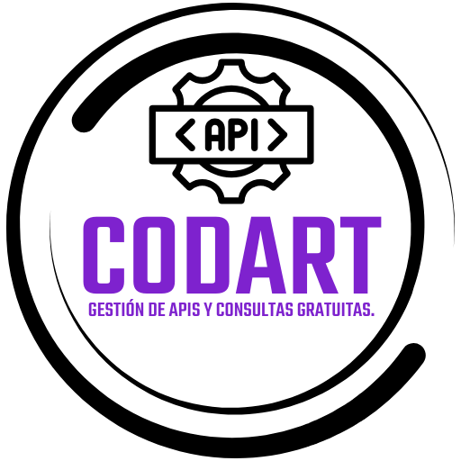

<p align="center">
  
</p>

<h1 align="center">Codart API Client</h1>

<p align="center">
  <strong>Aplicación cliente moderna e interactiva construida en Laravel para consumir, probar y visualizar las 20 APIs RESTful del ecosistema Codart.</strong>
</p>

<p align="center">
  
  
  
  
</p>

---

## 🚀 Características Principales

- ⚡ **20 Endpoints RESTful Conectados:**
  - **Identidad & RENIEC:** DNI RENIEC, DNI Virtual, DNI Electrónico, DNI Full, DNI Full T, Búsqueda por Nombres (`n1`, `ap1`, `ap2`), Árbol Genealógico.
  - **Empresas & SUNAT:** Consulta de RUC SUNAT.
  - **Contacto & Economía:** Teléfonos Fijos por DNI, Titularidad de Celular, Consulta de Sueldo / Renta, Dirección Domiciliaria.
  - **Antecedentes & Judicial:** Denuncias Policiales, Listado de Denuncias, Requisitorias Judiciales.
  - **Biometría:** Reconocimiento Facial Top con conversor dinámico de imagen local a Base64.
  - **Vehicular & SUNARP:** Consulta de Placa, Placa Denuncia, Placa Titular e Historial SOAT.

- 👁️ **Doble Vista de Resultados:**
  - **Vista Renderizada:** Presentación visual elegante con tarjetas, tablas de clave-valor, insignias de estado para valores booleanos y **visor automático de Imágenes y PDFs en Base64** con opción de descarga.
  - **Respuesta JSON:** Objeto JSON en formato legible con resaltado de código y botón de **Copiar JSON** al portapapeles.

- 🔒 **Backend Proxy Seguro:**
  - El token de producción se mantiene 100% seguro en el servidor backend mediante `ApiQueryController`, evitando exponer credenciales en el cliente web.

- ⏱️ **Alta Disponibilidad & Timeout de 50s:**
  - Conexiones HTTP configuradas con un tiempo de respuesta extendido a 50 segundos para soportar consultas pesadas sin cortes.

---

## 🛠️ Requisitos Previos

- **PHP** >= 8.2
- **Composer**
- Servidor Web local (Laragon, XAMPP o `php artisan serve`)
- Un Token de API activo de Codart.

---

## 📦 Instalación y Configuración

Sigue estos sencillos pasos para poner en marcha el proyecto en tu entorno local:

### 1. Clonar el Repositorio
```bash
git clone https://github.com/CodigoArtico/codart-api-client.git
cd codart-api-client
```

### 2. Instalar Dependencias de PHP
```bash
composer install
```

### 3. Configurar las Variables de Entorno (`.env`)
Copia el archivo de plantilla `.env.example` para crear tu `.env` local:

```bash
# En Linux / macOS:
cp .env.example .env

# En Windows (PowerShell):
copy .env.example .env
```

Genera la clave de la aplicación Laravel:
```bash
php artisan key:generate
```

### 4. Obtener e Ingresar tu Token de API Codart
1. Ve a la documentación oficial y portal de Codart API: 👉 **[https://api-codart.cgrt.org/documentation](https://api-codart.cgrt.org/documentation)**
2. Para generar tu token gratuito, ingresa a **[https://api-codart.cgrt.org/](https://api-codart.cgrt.org/)** e inicia sesión con Google o GitHub. Copia tu **API Token**.
3. Abre tu archivo `.env` y coloca el token en la variable `CODART_API_TOKEN`:

```env
CODART_API_BASE_URL=https://api-codart.cgrt.org
CODART_API_TOKEN=tu_token_aqui_sin_comillas
```

---

## ⚡ Ejecución del Proyecto

Inicia el servidor local de desarrollo de Laravel:

```bash
php artisan serve
```

Abre tu navegador web e ingresa a:
👉 **[http://127.0.0.1:8000](http://127.0.0.1:8000)**

---

## 📑 Lista de Consultas y Endpoints

| # | Consulta | Endpoint | Método |
|---|---|---|---|
| 1 | DNI RENIEC | `/api/v1/consultas/reniec/dni/{dni}` | `GET` |
| 2 | RUC SUNAT | `/api/v1/consultas/sunat/ruc/{ruc}` | `GET` |
| 3 | DNI Virtual | `/api/v1/consultas/fd/dniv/{dni}` | `GET` |
| 4 | DNI Electrónico | `/api/v1/consultas/fd/dnivel/{dni}` | `GET` |
| 5 | DNI Full | `/api/v1/consultas/fd/dni/{dni}` | `GET` |
| 6 | DNI Full T | `/api/v1/consultas/fd/dnit/{dni}` | `GET` |
| 7 | Búsqueda Nombres | `/api/v1/consultas/fd/nm` | `GET` |
| 8 | Árbol Genealógico | `/api/v1/consultas/fd/ag/{dni}` | `GET` |
| 9 | Dirección | `/api/v1/consultas/fd/dir/{dni}` | `GET` |
| 10 | Sueldo / Renta | `/api/v1/consultas/fd/suel/{dni}` | `GET` |
| 11 | Teléfono Fijo | `/api/v1/consultas/fd/telp/{dni}` | `GET` |
| 12 | Celular | `/api/v1/consultas/fd/telp/cel/{numero}` | `GET` |
| 13 | Denuncia Policial | `/api/v1/consultas/fd/den/{dni}` | `GET` |
| 14 | Lista Denuncias | `/api/v1/consultas/fd/denuncias/{dni}` | `GET` |
| 15 | Requisitorias | `/api/v1/consultas/fd/rqh/{dni}` | `GET` |
| 16 | Facial Top | `/api/v1/consultas/fd/facial/top` | `POST` |
| 17 | Placa Vehicular | `/api/v1/consultas/fd/pla/{placa}` | `GET` |
| 18 | Placa Denuncia | `/api/v1/consultas/fd/denpla/{placa}` | `GET` |
| 19 | Placa Titular | `/api/v1/consultas/fd/plat/{placa}` | `GET` |
| 20 | Historial SOAT | `/api/v1/consultas/fd/hsoat/{placa}` | `GET` |

---

## 🛡️ Licencia y Créditos

Desarrollado para el ecosistema **Código Ártico / Codart**.  
Licencia [MIT](LICENSE).
